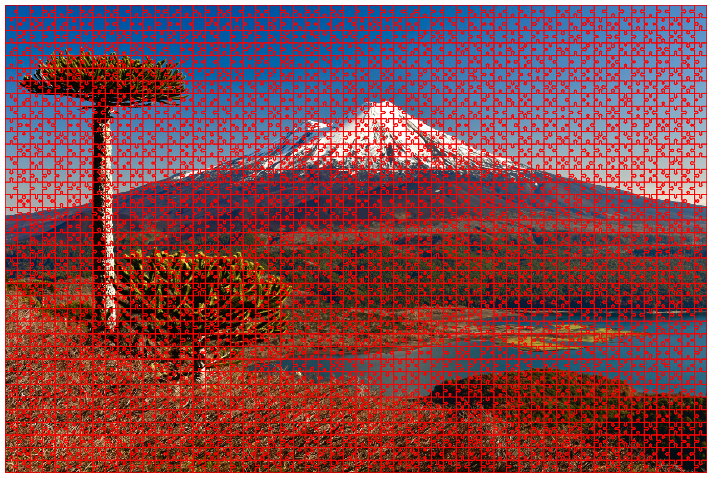
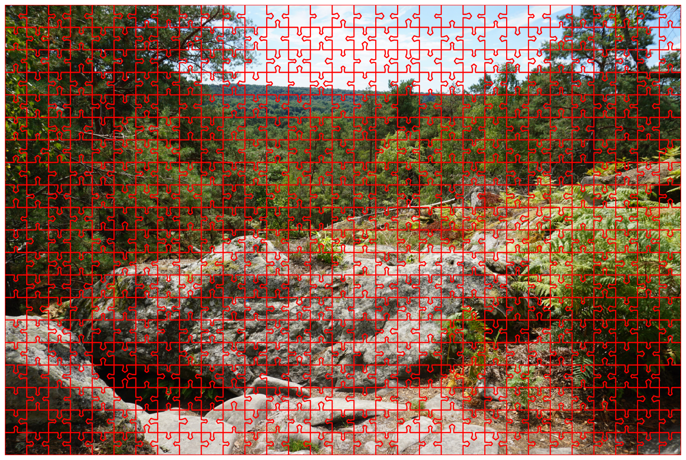
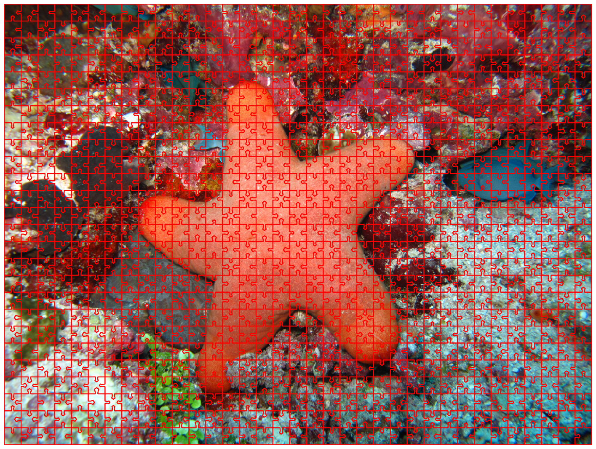
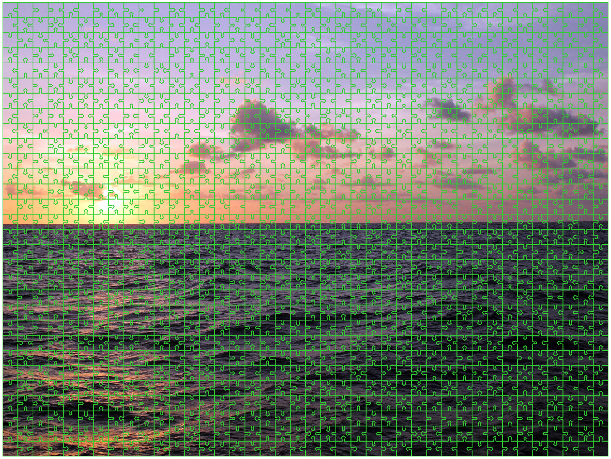

# Automatic-puzzle-generation

Code to automatically create a random mosaic to form puzzles.

Follow the following steps to create your own puzzles:

  1) Choose the number of pieces you want in width and height

  2) Use 'puzzle_net', 'minimize_tiles' and 'scale_tiles' to create and scale the tiles.

  3) Use 'show_puzzle' to visualize the creation.

Here are some exemple of what can be expected with the example pictures from the ./pictures folder.

